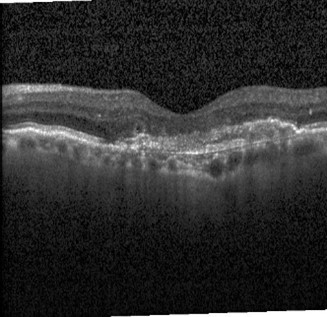
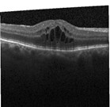
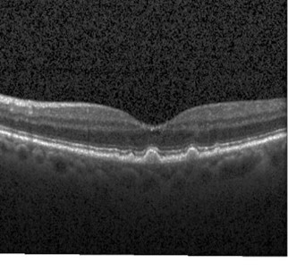
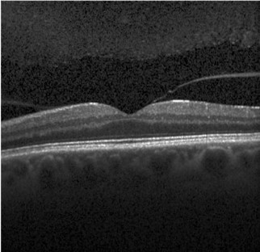

# INTRODUCTION

In recent decades, the widespread prevalence of several retinal lesions, especially for this project, CNV (Choroidal Neovascularization), DME (Diabetic Macular Edema), and Drusen have drawn imminent attention globally. These retinal diseases could be effectively diagnosed with the help of OCT (optical coherence tomography) images. With the recent surge and blossoming of deep learning techniques being incorporated for almost every use case, complemented by many publicly available datasets, the diagnosis of retinal or any disease has been revolutionized. To give a brief idea about how these three retinal diseases are often comprehended: CNV is a new, abnormal blood vessel growth from the choroid into the retina often associated with wet AMD (age-related macular degeneration), identified on OCT by abnormal vessels and associated fluid or retinal elevation. DME is fluid accumulation in the macula due to diabetic retinopathy causing vision distortion, evident as retinal thickening and cystic changes on OCT. Drusen are yellowish deposits under the retina linked to aging and early AMD, seen as elevated areas of varying reflectivity on OCT.

The current line of research proposes the development and comparison of advanced deep-learning models, such as InceptionV3, Xception, VGG19, and ResNet50, among others, that will augment the diagnostic confidence of physicians and ophthalmologists when making any diagnosis decisions from patients' OCT images.

  

# MOTIVATION

The digital age has ushered in both blessings and challenges. On one hand, advancements in technology have transformed our modes of communication, learning, and entertainment. On the other, the unrestrained and prolonged exposure to digital devices has started taking a toll on our eyesight. Children, youth, and even adults are engrossed in extended screen time, be it for work, education, or leisure. A recent study revealed that the average screen time for an individual has surged considerably in the past decade, correlating with an unprecedented increase in vision-related retinal ailments. This is alarming as screen time continues to rise, and the need for advanced diagnostic methods becomes more and more clearer. Delays or misses in diagnosis can have lasting consequences on vision, impacting both individuals and broader public health in general. Therefore, this project seeks to leverage deep learning techniques for early detection of retinal diseases, offering a proactive response to the unintended repercussions of our digital age.

# GOAL

The primary goal of this project is to harness the capabilities of advanced deep learning models for the classification of retinal diseases using OCT images, categorizing them into distinct classes: CNV, DME, Drusen, and normal. A significant dimension of this project lies in implementing and studying parallelization techniques on the Northeastern University's cluster. This emphasis on parallelization is anticipated to offer a substantial speedup in the training and evaluation phases of the models, paving the way for more efficient diagnostic methodologies in clinical scenarios.

# Description of Dataset:

The dataset comprises 84,495 retinal optical coherence tomography (OCT) images categorized into NORMAL, CNV, DME, and DRUSEN. These high-resolution images were sourced from adult patients across multiple eye institutes and were meticulously labeled through a rigorous tiered grading system. OCT scans, capturing retinal conditions like neovascularization and macular edema, underwent extensive validation by ophthalmologists and senior retinal specialists. This diverse dataset offers a valuable resource for developing advanced diagnostic tools in ophthalmology.

<table style="margin: 0; padding: 0; border-collapse: collapse;">
  <tr>
    <td style="text-align: center;"></td>
    <td style="text-align: center;"></td>
    <td style="text-align: center;"></td>
    <td style="text-align: center;"></td>
  </tr>
  <tr>
    <td style="text-align: center;">CNV</td>
    <td style="text-align: center;">DME</td>
    <td style="text-align: center;">DRUSEN</td>
    <td style="text-align: center;">NORMAL</td>
  </tr>
</table>

# Parallel Data Preparation for Training

  

# Parallel Data Preparation for Validation Set 

  

# Parallel Data Preparation for Test Set 

  

# Parallel Training of InceptionV3

  

# Parallel Training of ResNet50

  

# Model Performance

  

